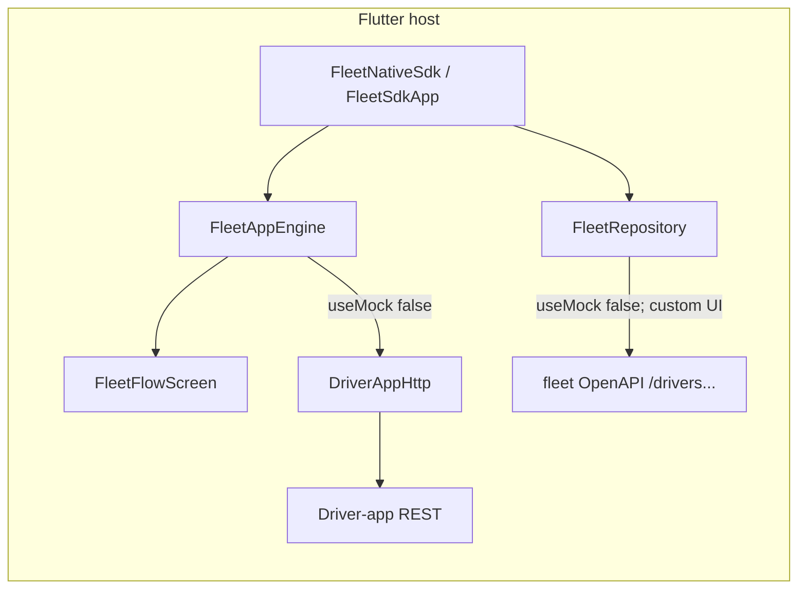

# Flutter — MGL Fleet SDK integration

This is the **single** integration guide for the **`mgl_fleet_sdk`** package ([`flutter-sdk/`](../flutter-sdk/)). 
Follow sections in order to complete integration in one pass.

Flutter **does not embed the TypeScript SDK**. The bundled driver UI talks to the **driver-app REST API** (same contract as [`components/mgl/driver-api.ts`](../components/mgl/driver-api.ts) and native `DriverAppApiClient`). Broader fleet contracts are described in [`openapi/fleet-api.yaml`](openapi/fleet-api.yaml).

---

## 1. Source repository and branch

| Item | Value |
|------|--------|
| **GitHub** | [https://github.com/sayemafatema/mgl-sdk](https://github.com/sayemafatema/mgl-sdk) |
| **Integration branch** | `mgl-app-sdk` |
| **Package directory** | [`flutter-sdk/`](../flutter-sdk/) |
| **Dart package name** | `mgl_fleet_sdk` |

```bash
git clone https://github.com/sayemafatema/mgl-sdk.git
cd mgl-sdk
git checkout mgl-app-sdk
```

---

## 2. UAT backend (driver fleet API)

| Environment | Base URL |
|-------------|----------|
| **UAT (driver app)** | `https://api-fleet-uat.enkash.in` |

Pass this as **`FleetConfig.apiBaseUrl`**. Do **not** append paths; the SDK adds `/api/v0/driver-app/...`, `/oauth/token`, etc.

If your organisation uses a different UAT host, substitute it here and in the examples below.

---

## 3. Prerequisites

- Flutter **3.x** with **`flutter`** / **`dart`** on **`PATH`** (`flutter doctor`).
- Dart **`>=3.0.0 <4.0.0`** (see [`flutter-sdk/pubspec.yaml`](../flutter-sdk/pubspec.yaml)).
- For **`useMock: false`**: reachable **`apiBaseUrl`** implementing the driver-app contract above.

---

## 4. One-shot integration checklist

Complete these in order:

| Step | Action |
|------|--------|
| **1** | Add **`mgl_fleet_sdk`** to the host app **`pubspec.yaml`** using **Section 5** (path and/or git). |
| **2** | Run **`flutter pub get`** in the host app. |
| **3** | Import **`package:mgl_fleet_sdk/mgl_fleet_sdk.dart`** and call **`FleetNativeSdk.root`** or **`FleetNativeSdk.present`** (Section 6). |
| **4** | Set **`FleetConfig`**: **`useMock: true`** for offline demo; **`useMock: false`** + UAT **`apiBaseUrl`** for live UAT. |
| **5** | Configure **Section 8** (Android/iOS) before exercising **Scan** on a device. |
| **6** | Run **`flutter analyze`**, then **`flutter run`** and verify **Section 10** (mock and/or UAT). |

---

## 5. Dependency (`pubspec.yaml`)

### Option A — Path (local clone)

```yaml
dependencies:
  flutter:
    sdk: flutter
  mgl_fleet_sdk:
    path: ../mgl-sdk/flutter-sdk   # adjust to your clone location
```

### Option B — Git (teams / CI)

```yaml
dependencies:
  flutter:
    sdk: flutter
  mgl_fleet_sdk:
    git:
      url: https://github.com/sayemafatema/mgl-sdk.git
      ref: mgl-app-sdk
      path: flutter-sdk
```

References: [Git-hosted dependencies](https://dart.dev/tools/pub/dependencies#git-packages).

Then:

```bash
flutter pub get
```

---

## 6. Entry points and `FleetConfig`

### Single call, full flow

| What you do | What you skip |
|-------------|----------------|
| Pass **`FleetConfig`** once | Wiring login, OTP/PIN, invite, tabs, scan confirmation, etc. |

Use **`FleetNativeSdk.root(config)`** with **`runApp`**, or **`FleetNativeSdk.present(context, config)`** from an existing **`Navigator`**. That mounts **`FleetFlowScreen`** via **`FleetSdkApp`**, driven by **`FleetAppEngine`**. **`FleetSdkApp`** is the underlying widget; **`FleetNativeSdk`** is the initialization-style façade.

**`FleetNativeSdk.present`** pushes a route whose child includes an inner **`MaterialApp`** — valid, but watch **nested `Theme` / inherited widgets** if the host depends on the outer app.

| Method | When |
|--------|------|
| **`FleetNativeSdk.root(config)`** | Fleet-only app or full-window experience. |
| **`FleetNativeSdk.present(context, config)`** | Embed from existing navigation. |
| **`FleetSdkApp(config: config)`** | Same as **`root`**; backward compatibility. |

```dart
import 'package:mgl_fleet_sdk/mgl_fleet_sdk.dart';
```

### Examples

**UAT — full window**

```dart
import 'package:flutter/material.dart';
import 'package:mgl_fleet_sdk/mgl_fleet_sdk.dart';

void main() {
  WidgetsFlutterBinding.ensureInitialized();
  runApp(
    FleetNativeSdk.root(
      const FleetConfig(
        apiBaseUrl: 'https://api-fleet-uat.enkash.in',
        useMock: false,
      ),
    ),
  );
}
```

**UAT — push**

```dart
await FleetNativeSdk.present(
  context,
  const FleetConfig(
    apiBaseUrl: 'https://api-fleet-uat.enkash.in',
    useMock: false,
  ),
);
```

**Mock / no backend**

```dart
FleetNativeSdk.root(
  const FleetConfig(
    apiBaseUrl: 'https://api-fleet-uat.enkash.in', // ignored when useMock is true
    useMock: true,
  ),
);
```

**Generic placeholder**

```dart
FleetNativeSdk.root(
  FleetConfig(
    apiBaseUrl: 'https://your-api.example',
    useMock: true,
  ),
);
```

More samples: [`flutter-sdk/README.md`](../flutter-sdk/README.md).

### `FleetConfig` fields

| Field | Purpose |
|-------|---------|
| **`apiBaseUrl`** | Driver-app API host (UAT: **`https://api-fleet-uat.enkash.in`**). |
| **`useMock`** | **`true`** — in-memory demo (same IDs as TS mocks). **`false`** — live driver-app HTTP via **`FleetAppEngine`** → **`DriverAppHttp`**. |
| **`authToken`** | Applied to **`FleetRepository`** headers only. The bundled **`FleetFlowScreen`** does **not** use it (driver-app flow always starts at login unless **Skip to main (dev)**). Use if **your** code calls **`FleetScope.of(context).repository`**. |

---

## 7. Architecture

**`FleetNativeSdk` / `FleetSdkApp`** wires **`FleetAppEngine`** + **`FleetFlowScreen`**. For **`useMock: false`**, the engine uses **`DriverAppHttp`** against **`apiBaseUrl`**.

**`FleetRepository`** (also constructed by **`FleetSdkApp`**) targets OpenAPI-style **`/fleet/drivers`** operations for **custom** UIs that opt into **`FleetScope`**; the **bundled** screens do **not** call it today.



Behaviour matches Angular **`FleetFlowHostComponent`**; **`FleetAppEngine`** mirrors TS **`FleetAppEngine`**.

There are **no per-screen integrations** for the bundled UX beyond this single mount point.

---

## 8. Android vs iOS (host app)

| Topic | Android | iOS |
|-------|---------|-----|
| **Networking** | **`INTERNET`** (typical default). Prefer HTTPS; cleartext only for controlled dev. | Prefer HTTPS; ATS works with UAT HTTPS without extra keys. |
| **Camera (QR)** | **`mobile_scanner`** merges camera usage; test on hardware or emulator with camera. | **`NSCameraUsageDescription`** in host **`Info.plist`** is **required** (e.g. “Camera is used to scan Fleetpay QR codes”). |
| **Deep links** | Custom schemes → **`AndroidManifest.xml`** intent filters. | Universal links → **URL types** / **Associated Domains**. |
| **Run** | **`flutter run`** — Android device/emulator. | Simulator or device; meaningful QR tests need a **device**. |

**Pure Flutter package:** no extra Gradle/CocoaPods entries beyond what Flutter resolves for **`http`** and **`mobile_scanner`**. For **native** fleet UI via the plugin, see [**`plugins/flutter-fleet/mgl_fleet_native_sdk`**](../plugins/flutter-fleet/mgl_fleet_native_sdk/) — that path is **not** this guide’s focus.

### Platform networking notes

| Topic | Guidance |
|-------|-----------|
| Android cleartext | Prefer HTTPS; enable cleartext only when needed for dev. |
| iOS ATS | Prefer HTTPS. |
| Emulator vs device | Use LAN IP or a deployed URL — **`localhost`** differs per emulator type. |

---

## 9. Bundled app capabilities

| Area | Capability |
|------|------------|
| **Authentication** | Mobile check, login OTP, OAuth (`grant_type=otp`), FO list, FO PIN unlock |
| **Onboarding** | Invite code, mobile OTP, invite validate, set fleet PIN |
| **Shell** | **Card**, **Scan**, **Assignments**, **Profile**; **Transactions** from card flow when shown |
| **Fleet** | Live home / assignments when **`useMock: false`**; pairing accept; mock demos when **`true`** |
| **Scan & pay** | Simulate scan, **`mobile_scanner`** camera, Fleetpay URIs, live **`driverQrPay`** |
| **Profile** | Summary; **Log out** |
| **Dev** | **Skip to main (dev)** — gate or remove for production |

---

## 10. End-to-end verification

### 10.1 In-repo example (mock)

From the **`mgl-sdk`** repository root:

```bash
cd flutter-sdk/example
flutter pub get
flutter run
# optional: flutter run -d chrome — then pick a device with flutter devices if needed
```

Example defaults: [`flutter-sdk/example/lib/main.dart`](../flutter-sdk/example/lib/main.dart) uses **`useMock: true`**.

### 10.2 Mock mode checklist (host or example)

With **`useMock: true`**, **no backend** is required. Demo OTP and PIN **`123456`**; pairing demo codes **`123456`**, **`789012`**; invite codes **`ABC123`**, **`XYZ789`**.

| # | Action | Expected |
|---|--------|----------|
| 1 | Launch | Login / invite visible |
| 2 | Login: 10-digit mobile → **Send OTP** | OTP entry |
| 3 | OTP **`123456`** | FO PIN or next step |
| 4 | FO PIN **`123456`** if shown | Main tabs |
| 5 | (Optional) Invite path → **`ABC123`** / **`XYZ789`** → OTP **`123456`** → set PIN | Shell |
| 6 | Card / Assignments | Demo assignment / pairing |
| 7 | Scan | **Simulate scan** / session PIN **`123456`** as UI allows |
| 8 | Profile → **Log out** | Back toward login |
| — | **Skip to main (dev)** | QA shortcut only |

**Manual short list (same flow):** **`flutter pub get`** → **`flutter run`** → login path → invite optional → demo assignment/pairing → scan simulate → profile logout. On failure: **`flutter doctor`**, **`dart analyze`** / **`flutter analyze`** on **`flutter-sdk/lib`**, verify **`path:`** / **`git:`** in **`pubspec.yaml`**.

### 10.3 UAT live checklist

| # | Action | Expected |
|---|--------|----------|
| 1 | **`FleetConfig(apiBaseUrl: 'https://api-fleet-uat.enkash.in', useMock: false)`** | Traffic to UAT |
| 2 | Login with **real UAT** mobile | SMS / UAT OTP |
| 3 | OTP + FO PIN per UAT data | Token; home / assignments |
| 4 | Assignments / pairing | Per UAT fixtures |
| 5 | Scan | Permissions OK; real QR per UAT |
| 6 | Transactions | Data from **`driverGetTransactions`** when UI exposes it |
| 7 | Log out | Session cleared in app |

If requests fail: network, TLS, URL, credentials; compare with **`DriverAppHttp`** (Section 11) and reference client **`components/mgl/driver-api.ts`**.

---

## 11. HTTP surface (live driver-app)

Implemented in **`DriverAppHttp`** (**`FleetAppEngine`**, **`useMock: false`**):

| Area | Dart methods | Typical paths (under **`apiBaseUrl`**) |
|------|----------------|----------------------------------------|
| Auth / OTP | `driverCheckMobile`, `driverSendLoginOtp`, `driverOauthOtpGrant` | `/api/v0/driver-app/auth/…`, `/oauth/token` |
| FO | `driverFoList`, `driverFoSelect` | `/api/v0/driver-app/auth/fo-list`, `fo-select` |
| Invite | `driverInviteMobileSendOtp`, `driverInviteMobileVerifyOtp`, `driverInviteValidate`, `driverInviteSetPin` | `/auth/mobile/…`, `/auth/invite/…` |
| Shell | `driverGetHome`, `driverGetProfile`, `driverGetAssignments` | `/home`, `/profile`, assignments |
| Ops | `driverAcceptPairing`, `driverQrPay`, `driverGetTransactions` | pairing, QR pay, transactions |

Exact paths and bodies align with **`components/mgl/driver-api.ts`** and native **`DriverAppApiClient`**.

---

## 12. Distributing the package to your team

You **do not** need to push **`mgl-sdk`** to GitHub for a **`path:`** dependency — a local clone is enough. Push only for collaboration, backup, or CI.

| How others get the code | Setup |
|-------------------------|--------|
| **`git clone`** | Point **`path:`** at **`…/mgl-sdk/flutter-sdk`** on their machine. |
| **Zip / share** | Extract repo; fix **`path:`**. |
| **Published / private pub** or **`git:`** | Depend by version or **`ref:`** (Section 5). |

**Teammate checklist:** Flutter **3.x**; **`path:`** / **`git:`** resolves; **same branch/tag** (e.g. **`mgl-app-sdk`**) for identical behaviour.

---

## 13. Custom UI / hand-written client

- If you **omit** **`FleetNativeSdk`** / **`FleetSdkApp`**, reimplement **`FleetRepository`**-style **`/fleet/drivers`** calls or driver-app calls yourself — same OpenAPI / TS contracts.
- Appendix and patterns: [**`flutter-integration/README.md`**](../flutter-integration/README.md).

---

## 14. Stay aligned when APIs change

1. Treat [**`openapi/fleet-api.yaml`**](openapi/fleet-api.yaml) and **`components/mgl/driver-api.ts`** as contract sources.
2. On changes: bump spec, TS core, then **`DriverAppHttp`** / **`FleetRepository`** (or regenerate Dart from OpenAPI if you adopt codegen).

---

## 15. Reference paths in this repo

| Resource | Path |
|----------|------|
| Package | [`flutter-sdk/`](../flutter-sdk/) |
| Example host | [`flutter-sdk/example/`](../flutter-sdk/example/) |
| OpenAPI | [`openapi/fleet-api.yaml`](openapi/fleet-api.yaml) |
| TS drivers (legacy OpenAPI client) | [`core-sdk/api/drivers-api.ts`](../core-sdk/api/drivers-api.ts) |

**Versioning:** Prefer branch **`mgl-app-sdk`** until you publish semver tags.

---

*Combined guide: UAT driver-app SDK, branch **`mgl-app-sdk`**. Replace the UAT URL in Section 2 if your environment differs.*
