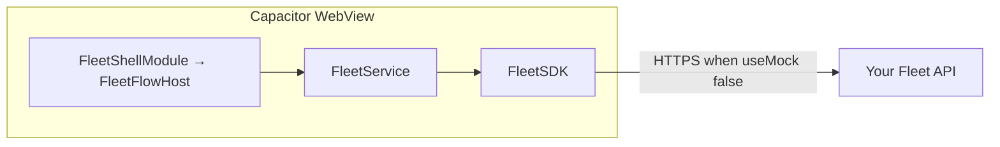

# Integrating with Angular + Capacitor

This guide explains **how your Angular app connects to the fleet SDK** and how to integrate **the whole fleet UI flow in one shot** (mobile login / invite signup → OTP / PIN → driver shell with tabs, overlays, and scan demo).

---

## Native SDK integration (recommended — standalone Angular)

**One initialization call** returns both root **`providers`** and **`routes`**:

```typescript
import {
  initFleetNativeSdk,
} from './fleet/fleet-native-sdk'; // path after copy — or '@mgl/fleet-angular-sdk'

const fleet = initFleetNativeSdk(
  { apiBaseUrl: environment.fleetApiUrl, useMock: true },
  { path: 'mgl-fleet' },
);

// bootstrapApplication(AppComponent, {
//   providers: [
//     fleet.providers,
//     provideRouter([ ...fleet.routes, ...yourRoutes ]),
//   ],
// });
```

Navigate to **`/mgl-fleet`** (or your **`path`**). **`FleetFlowHostComponent`** owns the entire journey — **do not** add separate SDK routes per screen.

Legacy **`FleetModule.forRoot`** still registers providers only (shell stays lazy); merge **`fleetNativeSdkRoutes()`** into **`provideRouter`** / **`RouterModule.forRoot`** — see **`angular-sdk/README.md`**.

For production APIs, keep **`useMock: false`** and set **`FleetService.setAuthToken`** when your host finishes real authentication.

---

## Seamless integration (overview)

| Approach | What you register |
|----------|-------------------|
| **Native SDK (recommended)** | **`initFleetNativeSdk(...)`** → **`fleet.providers`** + **`fleet.routes`** |
| **Manual** | **`provideFleetNativeSdk(config)`** + **`fleetNativeSdkRoutes({ path })`** |
| **NgModule legacy** | **`FleetModule.forRoot(...)`** + same **`fleetNativeSdkRoutes`** in router |

Nothing else is required for the bundled screens beyond **`core-sdk`** on **`npm`** and **`file:`** paths above.

---

## How the connection works

| Layer | What runs where | Role |
|--------|-----------------|-----|
| **Fleet UI shell** | Lazy **`FleetShellModule`** | **`FleetFlowHostComponent`** — auth + driver shell (**you do not wire each screen manually**). |
| **`@mgl/fleet-core-sdk`** | Same JS bundle | Headless logic: `fetch`, mocks, store, events — **no React**. |
| **`initFleetNativeSdk` / `provideFleetNativeSdk`** | Root injector | Config token + **`FleetService`** wrapping **`FleetSDK`**. |
| **Your HTTP API** | Server | REST contract in [`openapi/fleet-api.yaml`](openapi/fleet-api.yaml). |

Capacitor runs **one** WebView for your Angular app; the SDK is **TypeScript + templates** using **`fetch`** only.



---

## Prerequisites

- Node.js **20+** (building core SDK and Angular toolchain).
- Angular **17+** + Capacitor.
- `core-sdk` built (`dist/` present).

---

## Integrate this SDK (follow in order)

| Step | What to do |
|------|------------|
| **1** | Build **`core-sdk`** (`npm install && npm run build` in [`core-sdk/`](../core-sdk/)). |
| **2** | Add **`@mgl/fleet-core-sdk`** to your Angular app (`file:` path to built **`core-sdk`**, or registry). |
| **3** | Copy **[`angular-sdk/src/lib/`](../angular-sdk/src/lib/)** into your project (or consume as a library). |
| **4** | Call **`initFleetNativeSdk(config, { path: '…' })`** — add **`fleet.providers`** to bootstrap **`providers`** and **`...fleet.routes`** into **`provideRouter`**. |
| **5** | Run **`ng serve`** / Capacitor workflow → open **`/${path}`**. |

Skipping **`fleet.providers`** or omitting **`fleet.routes`** will break **`FleetFlowHostComponent`** at runtime.

Detailed snippets below: build core → **`npm`** deps → **`initFleetNativeSdk`** → **`NgModule`** fallback → auth token → Capacitor.

---

## Step 1 — Build the core SDK

```bash
cd core-sdk
npm install
npm run build
```

---

## Step 2 — Dependencies + Angular sources

In your Angular app **`package.json`**:

```json
{
  "dependencies": {
    "@mgl/fleet-core-sdk": "file:../../path/to/mgl-sdk/core-sdk"
  }
}
```

```bash
npm install
```

Copy **[`angular-sdk/src/lib/`](../angular-sdk/src/lib/)** into your workspace (`src/app/fleet/` or a library), keeping internal imports consistent.

---

## Step 3 — Native SDK bootstrap (standalone — recommended)

```typescript
import { ApplicationConfig } from '@angular/core';
import { provideRouter } from '@angular/router';
import { initFleetNativeSdk } from './fleet/fleet-native-sdk';

const fleet = initFleetNativeSdk(
  {
    apiBaseUrl: environment.fleetApiUrl,
    authToken: undefined,
    useMock: true,
  },
  { path: 'mgl-fleet' },
);

export const appConfig: ApplicationConfig = {
  providers: [
    fleet.providers,
    provideRouter([
      ...fleet.routes,
      // …your routes
    ]),
  ],
};
```

Navigate to **`/mgl-fleet`**.

---

## Step 4 — **`NgModule`** hosts (legacy)

Use **`FleetModule.forRoot`** **only** for providers — you **still** merge **`fleet.routes`** from **`initFleetNativeSdk`** into **`RouterModule.forRoot`** (the shell must stay lazy):

```typescript
import { FleetModule } from './fleet/fleet.module';
import { RouterModule } from '@angular/router';
import { initFleetNativeSdk } from './fleet/fleet-native-sdk';

const fleetConfig = {
  apiBaseUrl: environment.fleetApiUrl,
  authToken: undefined as string | undefined,
  useMock: true,
};
const fleet = initFleetNativeSdk(fleetConfig, { path: 'mgl-fleet' });

@NgModule({
  imports: [
    FleetModule.forRoot(fleetConfig),
    RouterModule.forRoot([
      ...fleet.routes,
      // …your routes
    ]),
  ],
})
export class AppModule {}
```

Alternatively call **`fleetNativeSdkRoutes({ path: '…' })`** instead of **`initFleetNativeSdk`** if you split providers (**`provideFleetNativeSdk`**) manually — see **`angular-sdk/README.md`**.

---

## Step 5 — Manual lazy route (equivalent to **`fleet.routes`**)

If you wire routing by hand, use **one** lazy entry:

```typescript
{
  path: 'mgl-fleet',
  loadChildren: () =>
    import('./fleet/fleet-shell.module').then((m) => m.FleetShellModule),
}
```

Adjust the **`import`** path to match your copy location.

### Flow inside the shell

| Route segment | Screen |
|---------------|--------|
| **`/mgl-fleet`** (child path **`''`**) | **`FleetFlowHostComponent`** — login/signup → OTP/PIN → driver shell (tabs + overlays). |

```typescript
this.router.navigate(['/mgl-fleet']);
```

Optional redirect:

```typescript
{ path: '', redirectTo: 'mgl-fleet', pathMatch: 'full' },
```

---

## Step 6 — Auth token (production)

After login:

```typescript
constructor(private fleet: FleetService) {}
this.fleet.setAuthToken(token);
```

Used when **`useMock: false`** (`Authorization: Bearer …`).

---

## Step 7 — Capacitor-specific configuration

1. **API URL on device** — Use a reachable HTTPS origin (not **`localhost`** on physical devices unless proxied).
2. **CORS** — Allow Capacitor WebView origins (**`capacitor://localhost`**, etc.).
3. **Sync** — **`ng build && npx cap sync`**.

---

## Test end-to-end (mock mode)

No backend is required when **`useMock: true`** (as in Step 3).

1. Start your app (**`ng serve`**, or your usual Capacitor dev workflow).
2. Open the fleet route (for example **`http://localhost:4200/mgl-fleet`** — adjust host/port/path).
3. **Login path:** enter any **10-digit** mobile → **Send OTP** → OTP **`123456`** → PIN **`123456`**. You should land on the driver shell (tabs visible).
4. **Dev shortcut:** **Skip to main (dev)** jumps straight to the shell (QA only).
5. **Invite path (optional):** **New user? I have an invite code** → **`ABC123`** or **`XYZ789`** → mobile → OTP **`123456`** → set PIN twice → shell.
6. In the shell: use tabs (**Card / Scan / Assign / Txns / Profile**). Try **Demo: assignment push** and **Demo: pairing** (pairing codes **`123456`**, **`789012`**).
7. **Scan:** pick an eligible vehicle → **Simulate scan** → authorize PIN **`123456`** → **Authorize**.
8. **Profile** → **Log out** returns to login.

---

## Do I need to push this code to GitHub?

**No.** Keep **`mgl-sdk`** locally and point **`package.json`** at **`core-sdk`** with **`file:…`**; copy **`angular-sdk/src/lib`** into your app. GitHub is optional—for backups, teams, or CI.

For installs without a disk path, publish **`@mgl/fleet-core-sdk`** / your Angular library to npm or a private registry, or consume from git using your organization’s standard (**`npm install git+…`** patterns vary).

---

## Integrate on someone else's machine

Another developer needs **the SDK sources** (or **published packages**) available **on their disk** or **from a registry**. You do **not** special-case “their machine”—only **how they obtain `mgl-sdk`** and **what paths they put in `package.json`**.

| How they get the code | Typical setup |
|----------------------|----------------|
| **`git clone`** your repo | They clone to e.g. **`~/code/mgl-sdk`**, run **`core-sdk`** **`npm install && npm run build`**, then point **`file:`** at **`…/mgl-sdk/core-sdk`** and copy/use **`angular-sdk/src/lib`** as in Steps **2–5**. Same repo path for teammates—everyone rebuilds **`core-sdk`** after **`git pull`**. |
| **Zip / shared drive** | Send a zip of **`mgl-sdk`** (or minimal **`core-sdk`** + **`angular-sdk`**). They unzip anywhere and use **`file:`** paths **relative to their host app**, e.g. **`file:../vendor/mgl-sdk/core-sdk`**. |
| **npm / private registry** | Publish **`@mgl/fleet-core-sdk`** (and optionally wrap **`angular-sdk`** as its own library). They **`npm install`** by package name—**no local clone**. You still ship **`angular-sdk`** sources or a published Angular library. |
| **Git dependency** | Possible for **`core-sdk`** if you expose it as installable from git (**`npm install git+https://…`**)—exact **`package.json`** shape depends on repo layout; **monorepo subfolders** often push teams toward **clone + `file:`** or **publish**. |

**Checklist for your teammate**

1. Node **20+**, Angular **17+**, **`core-sdk`** built (**`dist/`** exists).
2. **`package.json`** **`file:`** (or registry) **`@mgl/fleet-core-sdk`** resolves on **their** filesystem.
3. **`initFleetNativeSdk`** (or **`provideFleetNativeSdk`** + **`fleetNativeSdkRoutes`**) wired as in this doc.
4. Optional: pin the same **Git tag/commit** as you so **`core-sdk`** behaviour matches.

---

## Optional — Embed individual widgets only

If you **don’t** want the full shell, import **`FleetModule.forRoot`** only and build your own routes while driving **`FleetService.raw().appFlow`** (same **`FleetAppEngine`** as the host component).

---

## Troubleshooting

| Symptom | Check |
|---------|--------|
| Blank fleet route | **`fleet.providers`** in bootstrap; **`...fleet.routes`** inside **`provideRouter`**; navigate to **`/${path}`**. |
| `FleetSDK` import fails | Rebuild **`core-sdk`**; verify **`package.json`** paths. |
| Network errors | URL, HTTPS, CORS, auth token when `useMock: false`. |

---

## Related files

- Native SDK bootstrap: [`angular-sdk/src/lib/fleet-native-sdk.ts`](../angular-sdk/src/lib/fleet-native-sdk.ts)
- Shell routes: [`angular-sdk/src/lib/fleet-shell.routes.ts`](../angular-sdk/src/lib/fleet-shell.routes.ts)
- Core: [`core-sdk/fleet-sdk.ts`](../core-sdk/fleet-sdk.ts)
- OpenAPI: [`openapi/fleet-api.yaml`](openapi/fleet-api.yaml)
