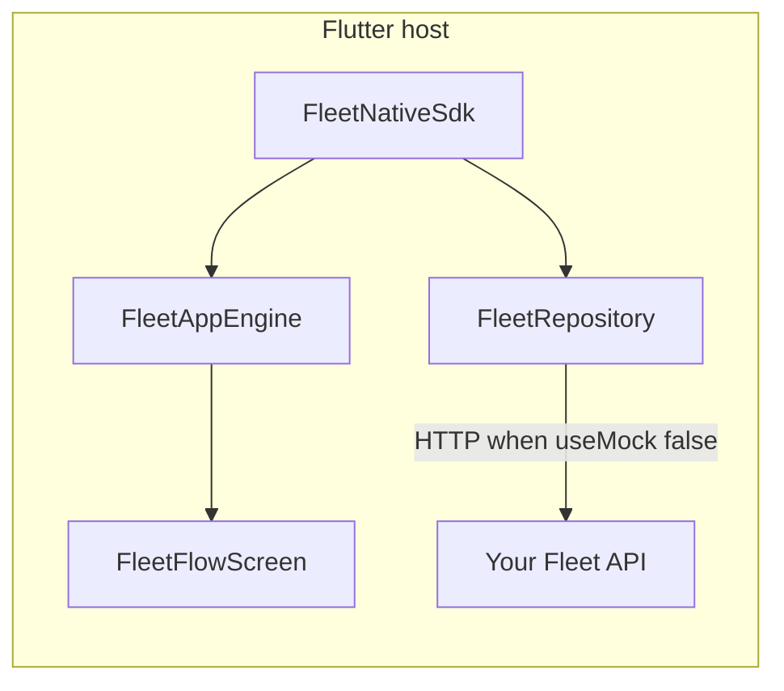

# Integrating with a Flutter app

Flutter **does not load the TypeScript SDK**. It connects through the **same REST API** as [`openapi/fleet-api.yaml`](openapi/fleet-api.yaml).

---

## Seamless integration (entire flow, one initialization)

Use **`FleetNativeSdk.root(config)`** (`runApp`) or **`FleetNativeSdk.present(context, config)`** from your existing navigator. That **single** call mounts **`FleetFlowScreen`** via **`FleetSdkApp`**, driven end-to-end by **`FleetAppEngine`**:

| What you do | What you skip |
|-------------|----------------|
| Pass **`FleetConfig`** (`apiBaseUrl`, `useMock`, optional `authToken`) once | Wiring login, OTP/PIN, invite signup, tabs, overlays, or scan confirmation screens individually |

**`FleetSdkApp`** remains the underlying widget — **`FleetNativeSdk`** is the native-SDK façade for hosts that only want initialization-style calls.

There are **no separate screen integrations** for the bundled UX path when using **`FleetNativeSdk`** — only **`FleetRepository`** HTTP when **`useMock: false`**.

---

## Prerequisites

- Flutter SDK (**3.x**) with **`dart`** / **`flutter`** on your **`PATH`**.
- For **`useMock: false`**, a reachable **`apiBaseUrl`** and backend implementing [`openapi/fleet-api.yaml`](openapi/fleet-api.yaml).

---

## Integrate this SDK (follow in order)

| Step | What to do |
|------|------------|
| **1** | Add **`mgl_fleet_sdk`** as a **`path:`** dependency in your host app **`pubspec.yaml`**, pointing at **[`flutter-sdk/`](../flutter-sdk/)** (or a local copy). |
| **2** | Run **`flutter pub get`** in the host app. |
| **3** | Import **`package:mgl_fleet_sdk/mgl_fleet_sdk.dart`** and call **`FleetNativeSdk.root`** or **`FleetNativeSdk.present`**. |
| **4** | Use **`FleetConfig(apiBaseUrl: '…', useMock: true)`** for offline demo; set **`useMock: false`** when your API exists. |
| **5** | Run **`flutter analyze`** (recommended), then **`flutter run`** on simulator or device to verify the flow end-to-end. |

---

## **`FleetNativeSdk`** — native entry

This repo ships **`mgl_fleet_sdk`** — **`FleetNativeSdk`** is the **initialization-only** API; it wraps **`FleetSdkApp`** (same full flow: mobile login / invite signup → OTP / PIN → driver shell). Behaviour matches Angular **`FleetFlowHostComponent`**; Dart **`FleetAppEngine`** mirrors TS **`FleetAppEngine`**.

### How it connects



| Mode | Behaviour |
|------|-----------|
| `FleetConfig(useMock: true)` | In-memory demo drivers (same IDs as TS mocks). |
| `useMock: false` | `GET/PATCH /fleet/drivers…` aligned with TS **`DriversApi`**. |

### Code — add dependency

```yaml
dependencies:
  mgl_fleet_sdk:
    path: ../path/to/mgl-sdk/flutter-sdk
```

Then **`flutter pub get`**.

### Code — launch (native SDK)

**Option A — entire window**

```dart
import 'package:flutter/material.dart';
import 'package:mgl_fleet_sdk/mgl_fleet_sdk.dart';

void main() {
  WidgetsFlutterBinding.ensureInitialized();
  runApp(
    FleetNativeSdk.root(
      FleetConfig(
        apiBaseUrl: 'https://your-api.example',
        useMock: true,
      ),
    ),
  );
}
```

**Option B — push from existing `MaterialApp`**

```dart
await FleetNativeSdk.present(
  context,
  FleetConfig(useMock: false, apiBaseUrl: baseUrl),
);
```

More examples: [`flutter-sdk/README.md`](../flutter-sdk/README.md).

---

## Test end-to-end (mock mode)

With **`useMock: true`**, **no backend** is required.

### Example app in **this** repo (Flutter SDK)

```bash
cd flutter-sdk/example
flutter pub get
flutter run -d chrome   # or: flutter devices → flutter run -d <id>
```

Same demo credentials as below (**OTP/PIN `123456`**).

### Manual checklist

1. **`flutter pub get`** then **`flutter run`** from your host project.
2. **Login:** any **10-digit** mobile → **Send OTP** → **`123456`** → PIN **`123456`**. You should see the shell tabs.
3. **Skip shortcut:** **Skip to main (dev)** (QA only).
4. **Invite (optional):** **New user? I have an invite code** → **`ABC123`** or **`XYZ789`** → mobile → OTP **`123456`** → set PIN twice → shell.
5. Try **Demo: assignment push**, **Demo: pairing** (codes **`123456`**, **`789012`**).
6. **Scan:** vehicle chip → **Simulate scan** → authorize **`123456`**.
7. **Profile** → **Log out**.

If something fails: **`flutter doctor`**, **`dart analyze`** on **`flutter-sdk/lib`**, and check **`path:`** in **`pubspec.yaml`**.

---

## Do I need to push this code to GitHub?

**No.** A **`path:`** dependency works with a local **`mgl-sdk`** folder.

Push to **GitHub** (or similar) only when you want collaboration, backups, or CI—not because Flutter integration requires it.

---

## Integrate on someone else's machine

They need **`mgl_fleet_sdk`** on **their** disk (**or** a published Dart package). **`path:`** must point from **their host app’s `pubspec.yaml`** to **their** copy of **`flutter-sdk/`**.

| How they get the code | Typical setup |
|----------------------|----------------|
| **`git clone`** | Clone **`mgl-sdk`** → set **`path: ../relative/path/to/mgl-sdk/flutter-sdk`** (or absolute path). Run **`flutter pub get`** in **their** host app. |
| **Zip / shared drive** | Unzip **`mgl-sdk`** beside (or inside) their repo → adjust **`path:`** accordingly. |
| **Published package** | If you publish **`mgl_fleet_sdk`** to a private Pub server or **[Git‑hosted dependency](https://dart.dev/tools/pub/dependencies#git-packages)** (`git:` URL), they depend by **version / git ref** instead of **`path:`**. |

**Checklist for your teammate**

1. Flutter **3.x**, **`flutter doctor`** clean enough to run **`flutter pub get`** / **`flutter run`**.
2. **`pubspec.yaml`** **`path:`** (or **`git:`**) resolves on **their** machine after clone/unzip.
3. Same **branch/tag** as you if you want identical demo behaviour.

---

## Alternative — Hand-written Dart client only

If you **don’t** use **`FleetNativeSdk`** / **`FleetSdkApp`**, implement **`FleetRepository`-equivalent** calls yourself — same paths as OpenAPI / TS SDK. Examples (manual copy): [`flutter-integration/README.md`](../flutter-integration/README.md).

---

## Platform networking

| Topic | Guidance |
|-------|-----------|
| Android cleartext | Prefer HTTPS; enable cleartext only for controlled dev. |
| iOS ATS | Prefer HTTPS. |
| Emulator vs device | Use LAN IP or deployed URL — **`localhost`** differs per emulator. |

---

## Stay aligned with Angular / TS

1. Treat **`docs/openapi/fleet-api.yaml`** as the contract.
2. When APIs change, bump spec + rebuild TS core + update **`FleetRepository`** (or regenerate Dart from OpenAPI).

---

## Related files

- Package: [`flutter-sdk/`](../flutter-sdk/)
- OpenAPI: [`openapi/fleet-api.yaml`](openapi/fleet-api.yaml)
- TS reference: [`core-sdk/api/drivers-api.ts`](../core-sdk/api/drivers-api.ts)
